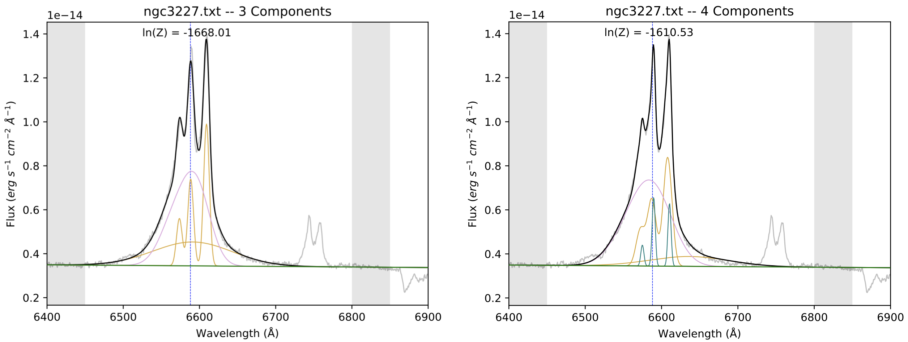
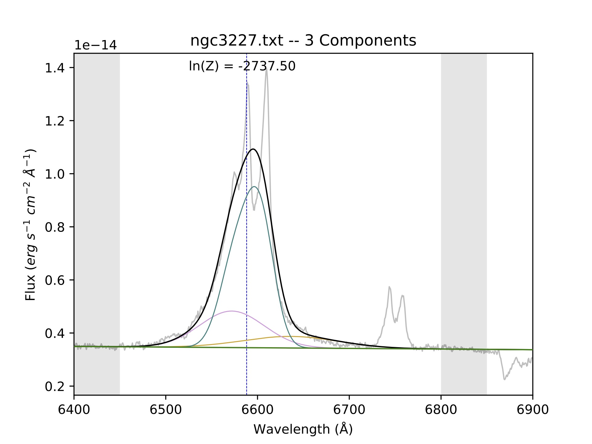

Customizing your fits
==========================
*Contributors: Julia Falcone,  Dzhuliya Dashtamirova*

At this point, you should be able to run the example BEAT code in a way that produces an output folder with plots, as shown on the previous page. However, there are a lot of parameters that we see in the code! This page will define these parameters, and you can observe how the example fits change depending on any adjustments to the parameters.

Reading in data
------------

Currently, BEAT uses the ``load_file`` function to read in data via individual text files for each spectrum that commonly take the ``.csv`` or ``.tsv`` format, although you're free to choose any text delimiter. Each text file must have a wavelength and flux array, with the wavelength units typically in Angstroms. You can either load in a noise array with the function, or calculate a noise array within the function.

As you will read below, BEAT runs on all the spectra within a designated directory, so it is suggested that all spectra in a directory be the same file format so they can be easily read in succession. We hope to introduce compatability with data cubes in the future, so that extraction of individual spectra is not needed.

Adjusting parameters
------------

In the ``main()`` function, there are three subsections of parameters: ``target_param``, ``cont_instructions``, and ``fit_instructions``. 

target_param
^^^^^

.. list-table:: 
   :header-rows: 1
   :class: tight-table

   * - Parameter name
     - Description
   * - ``name``
     - Name of your target (in string format)
   * - ``red``
     - Redshift of your target
   * - ``minwidth``
     - The minimum Gaussian sigma value to be fit to features. See [a] below for more details on units.
   * - ``maxwidth``
     - The minimum Gaussian sigma value to be fit to features. This value should be set to the maximum width expected in the spectra. Emission-line gas in the example spectra likely does not exceed FWHM = 2000 km/s, so we will use that to define the maximum width. See [a] below for more details on units.
   * - ``start``
     - Minimum array value used in input spectrum
   * - ``fluxsigma``
     - Minimum S/N value. The flux height must be greater than this value multiplied by the standard deviation to be considered a legitimate fit. This value is typically 3. 
   * - ``plotmin``
     - The x-axis minimum wavelength in output plots, in units of Angstroms
   * - ``plotmax``
     - The x-axis maximum wavelength in output plots, in units of Angstroms
   * - ``maxcomp``
     - The maximum number of Gaussian components that can be attempted per line. This is often 3, and can go as high as 5 or 6 (but will run very slowly). However, BEAT will stop fitting when a more complex model is less likely than a simpler model (e.g. when using 2 components is a less likely fit than 1 component). Thus, even if we set a maxcomp value of 6, the routine will likely only fit up to 3 components per spectrum.
   * - ``lnz``
     - Minimum acceptable logarithm of the ratio of Bayesian evidences. This should usually be 5. See Feroz et al. 2011 and Section 3.1 of Falcone et al. 2024 for more information on ln(z). 
   * - ``cores``
     - Number of processors that are free to be assigned to multiprocessing pool. Currently, personal laptops usually have 4 processors, so try changing cores to 2 and note the difference in time it takes to finish fitting the spectra. Always allow one free processor to continue using your computer!   
       

[a] The units for the minwidth and maxwidth paramters are in sigma (will need to change this)

cont_instructions
^^^^^

In BEAT, we measure the height of the emission lines against a continuum region. We manually define the continuum by choosing two regions slightly above and below the lines we wish to observe. In the example fits on the previous page, the continuum regions are shown as gray shaded regions on either side of the fitted lines, and are intended to be areas of low emission. The continuum fit, which is marked on the output plots as a dark green line, is calculated with a slope that best connects the average fluxes of the two regions.

.. list-table:: 
   :header-rows: 1
   :class: tight-table

   * - Parameter name
     - Description
   * - ``form``
     - The type of input continuum. Currently only "model" is supported, but we hope to add support for data in the future.
   * - ``cont_poly``
     - Degree of polynomial fit to continuum
   * - ``continuum1``
     - The wavelength range, in units of Angstroms, for the first flux bin sampled to derive the continuum. Usually to one side (the left) of your measured feature(s).
   * - ``continuum2``
     - The wavelength range , in units of Angstroms, for the second flux bin sampled to derive the continuum. Usually to one side (the right) of your measured feature(s).

fit_instructions
^^^^^

This section defines the narrow-line components that you wish to fit. You can add or take away the number of lines, but in general BEAT's runtime is most reasonable with 5 lines or fewer. The narrow lines that you define will be fit with up to the number of components designated in ``maxcomp``.

.. list-table:: 
   :header-rows: 1
   :class: tight-table

   * - Parameter name
     - Description
   * - ``name``
     - The name of the emission line, which is used in the output files.
   * - ``wave``
     - The rest wavelength of the emission line.
   * - ``minwave``
     - The minimum redshift-corrected centroid wavelength allowed when fitting Gaussians. For example, if you are fitting a high-redshift target, you would expect ``minwave`` to be significantly higher than the rest wavelength. 
   * - ``flux_free``
     - This is a logic switch on whether the flux of an emission line is reliant on another line. For example, [N II] at λ6548 A (line2) is in a doublet with [N II] λ6583 A (line3). Therefore, ``flux_free`` for line3 would be False, but for line2 the ``flux_free`` would be True because it needs the freedom to fit the data, and line3 would then be scaled according to the ``flux_ratio``.   
   * - ``locked_with``
     - If ``flux_free`` is ``False``, this parameter names the emission line that it's linked to. In this example, [N II] λ6583 A (line3) is locked with [N II] at λ6548 A (line2).
   * - ``flux_ratio``
     - This value specifies the fractional difference in flux between the doublet. For example, N [II] λ6583 A has a flux 3 times greater than that of [N II] at λ6548 A, so the ``flux_ratio`` for ``line3`` (which corresponds to [N II] at λ6548 A) is 3.
       

Incorporating a broad line fit
------------
Targets such as Seyfert 1 galaxies possess both broad and narrow lines. However, whereas narrow line components are relatively free to scale in various ways depending on the data and the number of narrow line components may change from one position to the next, the number of broad line components and the fluxes of the broad line components relative to each other are fixed. In order to fit both broad and narrow lines as accurately as possible, we use an iterative procedure.

.. tip::
Why don't we choose to fit broad and narrow lines simultaneously, essentially repeating our process for the NLR fit but leaving space for more lines to be fit? In our experience, when we fit them both together, BEAT may opt for fits that may improve the quality of the NLR fit while worsening the quality of the BLR fit. An example can be seen in the images below. Notice how the broad wings are fit better for the 3-component fit on the left than they are for the 4-component fit on the right, but because the narrow fits are improved from the left to the right, the 4-component fit is deemed better. By fitting the broad and narrow lines separately, we can ensure the best fits for both. 

Step 1: Fitting only the broad lines
^^^^^^^^^^^^^^^^^^^^^^^^^^^^^^^^^^^^
In our first example fit which had only narrow lines in its spectrum, we allowed BEAT to fit lines of any width up to a ``maxwidth`` of 5 (corresponding to ~230 km/s). Because the narrow lines are fairly well constrained in their widths, as long as the ``maxwidth`` is above the values of the widths, the fit will also be well constrined.

However, the ``maxwidth`` value has more significance when we introduce a spectrum with broad and narrow lines. The first part of this process will involve only fitting the broad line(s). It will be done once to a single spectrum in your data set, and then those resulting Gaussians will be applied to the rest of the spectra when fitting the narrow lines. 

The first step is to run BEAT on your spectrum, where the ``minwidth`` is now 15 and the ``maxwidth`` can be a significantly value like 50. It will likely produce a three-component fit with similar parameters as shown below:

.. list-table:: 
   :header-rows: 1

   * - Line color
     - Wavelength centroid
     - Width
     - Flux
   * - Blue/teal
     - 6629
     - 50
     - 2.42E-14
   * - Pink
     - 6570
     - 34.1
     - 9.80E-14
   * - Orange
     - 6582
     - 15
     - 8.92E-14

In the above image, the blue curve is clearly trying to fit the narrow components. Therefore, we determine that our first estimate of the broad components are the orange and pink fits, whose parameters are shown in the table above. To understand how we extracted the parameters for the table, please look at the :ref:`my-reference-label` page.

Step 2: Fitting the spectrum with new broad parameters
^^^^^^^^^^^^^^^^^^^^^^^^^^^^^^^^^^^^

In this step, we copy the parameters from the pink and orange curves into ``prefit_instructions``, calculating the flux ratio from the fluxes. Now, we reset the 

Parameters at the bottom of the code block
------------
At the bottom of the main block of code for where the parameters are edited, there is a section that reads:

.. code-block:: python 

   fit = beat.Fit(out_dir='', 
                  spec_dir='NLR spectrum',
                  load_file=load_file,
                  target_param=target_param,
                  cont_instructions=cont_instructions,
                  fit_instructions=fit_instructions,
                  prefit_instructions=prefit_instructions #Note: this line is only present in broad-line fits.
                  )
   fit.mp_handler()

The parameters ``load_file``, ``target_param``, ``cont_instructions``, and ``fit_instructions`` can remain with those inputs. The ``prefit_instructions`` parameter is only present when we are considering broad line components; if we are only fitting narrow components, we can remove that line of code.

``out_dir`` defines the directory where the results folder will be output. Its current input, ``''``, means that it will be placed in the current working directory.

``spec_dir`` points to the directory holding the spectra that you wish to fit. To read more about how to input these spectra, please refer to the `Reading in data`_ section above. 

