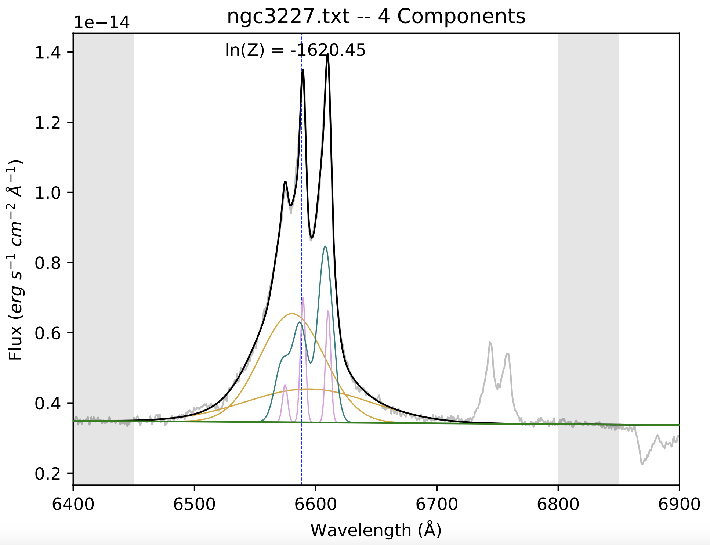
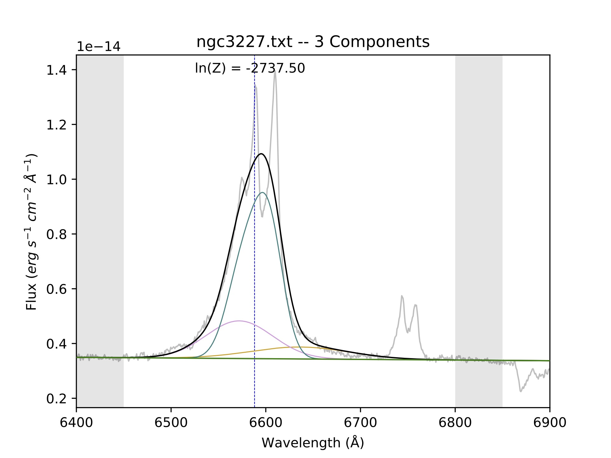
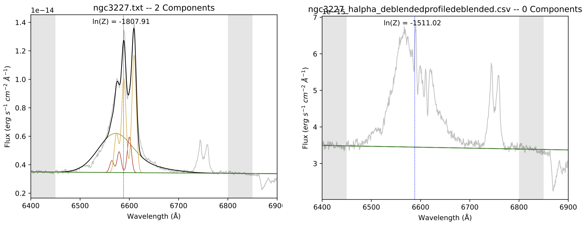
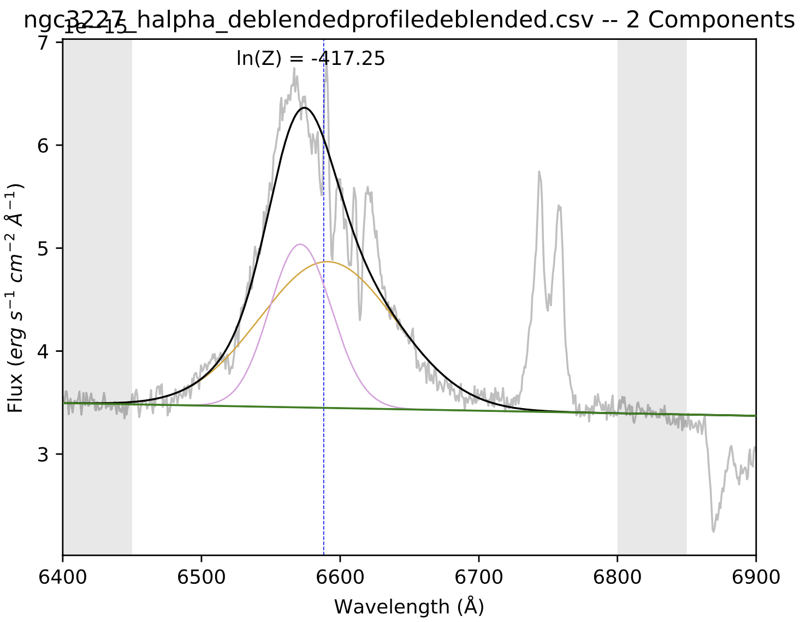
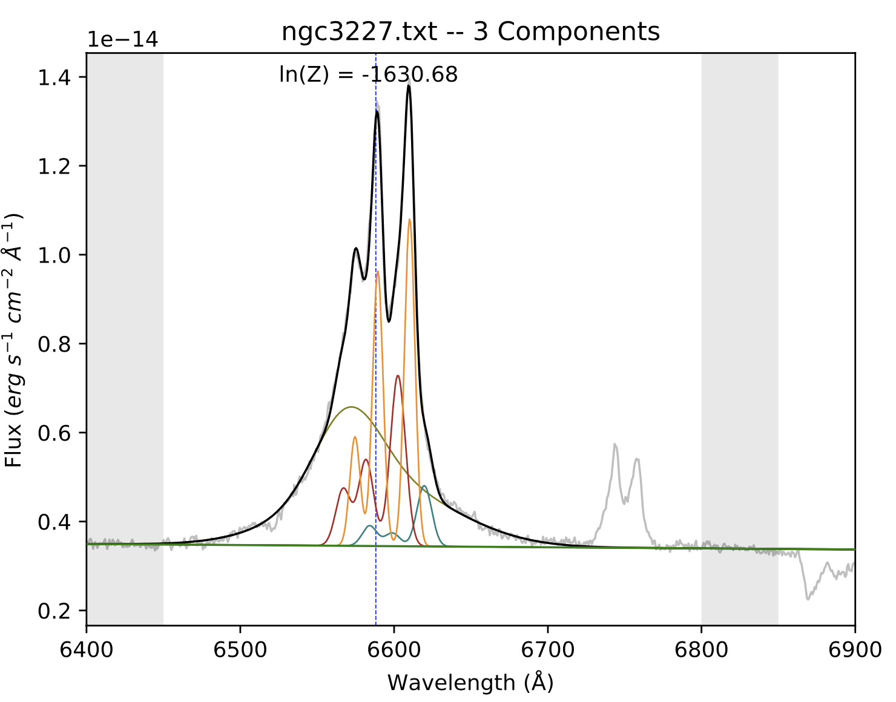

Incorporating a broad line fit
======
*Contributor: Julia Falcone*

Targets such as Seyfert 1 galaxies possess both broad and narrow lines. However, whereas narrow line components are relatively free to scale in various ways depending on the data and the number of narrow line components may change from one position to the next, the number of broad line components and the fluxes of the broad line components relative to each other are fixed. Thus, you only have to solve for the broad component once, and then it can be reapplied to the rest of the data in your data set.

There are two ways we can go about solving for the broad components. You are free to follow along in the example Jupyer notebook:

Method 1: Fit Everything at Once
-------

The most straightforward method would be to fit broad and narrow lines simultaneously, and then extract the broad line components from the results. The parameters are shown in the example Jupyter notebook under the same heading as this subsection. Note that the ``mindiwth`` and ``maxwidth`` are 1 and 50, respectively, and that ``maxcomp`` is 5. See [other page] to read more about how to determine these values for your own data. Note that this method can become computationally expensive, as each additional fitted component requires an exponential increase in resources.

The resulting best fit is shown below, along with the output parameters.

.. list-table:: 
   :header-rows: 1

   * - Line color
     - Wavelength centroid
     - Width
     - Flux
   * - Blue/teal
     - 6587
     - 6.1
     - 4.14E-14
   * - Pink
     - 6589
     - 2.1
     - 1.89E-14
   * - Orange (tall)
     - 6579
     - 25.8
     - 1.83E-13
   * - Orange (short)
     - 6585
     - 50
     - 3.75E-14
       

The two orange curves are the broad components, and so those parameters form the basis of the ``prefit_instructions`` for all the other fits of these lines in this data set.

Method 2: Use an Iterative Prodecure
-------

Step 1: Fitting only the broad lines
^^^^^^^^^^^^^^^^^^^^^^^^^^^^^^^^^^^^
In our first example fit which had only narrow lines in its spectrum, we allowed BEAT to fit lines of any width up to a ``maxwidth`` of 5 (corresponding to ~230 km/s). Because the narrow lines are fairly well constrained in their widths, as long as the ``maxwidth`` is above the values of the widths, the fit will also be well constrined.

However, the ``maxwidth`` value has more significance when we introduce a spectrum with broad and narrow lines. The first part of this process will involve only fitting the broad line(s). It will be done once to a single spectrum in your data set, and then those resulting Gaussians will be applied to the rest of the spectra when fitting the narrow lines. 

The first step is to run BEAT on your spectrum, where the ``minwidth`` is now 15 and the ``maxwidth`` can be a significantly value like 50. It will likely produce a three-component fit with similar parameters as shown below. It might be puzzling that we allow the ``maxwidth`` of narrow lines to only go up to 5, whereas the broad lines have a ``minwidth`` of 15. What about the lines in the middle, with a width of 5 - 15? Such lines belong to the `intermediate line region <https://arxiv.org/pdf/1709.07393>`_ (IRL), whose emission lines are semi-blended. Kinematic studies can reveal whether your target has a prevalent ILR, and in the case of this specific example (NGC 3227), it does not. Please note that these values for the widths are rough estimates, and may not apply in exactly the same way to your target(s). 

.. list-table:: 
   :header-rows: 1

   * - Line color
     - Wavelength centroid
     - Width
     - Flux
   * - Blue/teal
     - 6629
     - 50
     - 2.42E-14
   * - Pink
     - 6570
     - 34.1
     - 9.80E-14
   * - Orange
     - 6582
     - 15
     - 8.92E-14

In the above image, the blue curve is clearly trying to fit the narrow components. Therefore, we determine that our first estimate of the broad components are the orange and pink fits, whose parameters are shown in the table above. To understand how we extracted the parameters for the table, please look at the :ref:`my-reference-label` page.

Step 2: Fitting the spectrum with new broad parameters
^^^^^^^^^^^^^^^^^^^^^^^^^^^^^^^^^^^^

In this step, will be fitting narrow lines to our spectrum using the broad components that we just found in Step 1. We copy the parameters from the pink and orange curves into ``prefit_instructions``, calculating the flux ratio from the fluxes, and reset the ``minwidth`` and ``maxwidth`` parameters back to 1 and 5, respectively. 

Notice how, in the ``fit = beat.Fit`` section of the code, there is a new parameter that reads ``save_NLR_removed = True``. This is because once BEAT fits the narrow components to the spectrum, it will then subtract those components from the data, thereby isolating the broad region. The left image below is the final fit from this BEAT run. It's evident that this broad region still needs some improvement, as it looks unusually shifted to the left, but this isn't concerning because the fit will improve with each iteration. On the right is the spectrum in the ``NLR_removed`` directory that is created in the output, which has subtracted the two narrow line components in the left image from the data. The spectrum is pretty jagged, but this can also improve with future iterations.  

Step 3: Fitting the NLR-subtracted spectrum
^^^^^^^^^^^^^^^^^^^^^^^^^^^^^^^^^^^^

In this round of fitting, we are going to use the same ``maxwidth`` and ``minwidth`` that we used for Step 1. This is because we're fitting the NLR-subtracted spectrum seen in the right-hand image of the last step. If we assume the broad region is isolated with this spectrum, we can limit ourselves to only fiting broad lines. Note that ``spec_dir`` should now point to the ``NLR_removed`` directory that was produced in the previous step. The image below shows the resulting fit to this spectrum.

Step 4: Fitting the spectrum with newer broad parameters
^^^^^^^^^^^^^^^^^^^^^^^^^^^^^^^^^^^^

Now that I have an improved set of broad parameters, we can put them back into the ``prefit_instructions`` and once again reset our ``minwidth`` and ``maxwidth`` to identify narrow lines (i.e., set them to 1 and 5, respectively).

The figure above shows our resulting 3-component fit that accurately models both the broad- and narrow-line region. Steps 3 and 4 could be repeated again, but more iterations does not necessarily result in a better fit. To know whether successive iterations are better fits than previous ones, you should compare the fits' ln(Z) values. For more information about the ln(Z) parameter, see `Feroz et al. 2011 <https://ui.adsabs.harvard.edu/abs/2011MNRAS.415.3462F/abstract>`_ and Section 3.1 of `Falcone et al. 2024 <https://ui.adsabs.harvard.edu/abs/2024ApJ...971...17F/abstract/>`_ 

Once you are satisfied with the quality of this fit, the broad region parameters-- which are to say, the output parameters that you get from Step 3-- can then be implemented into the ``prefit_instructions`` for all fits of this dataset going forward. 