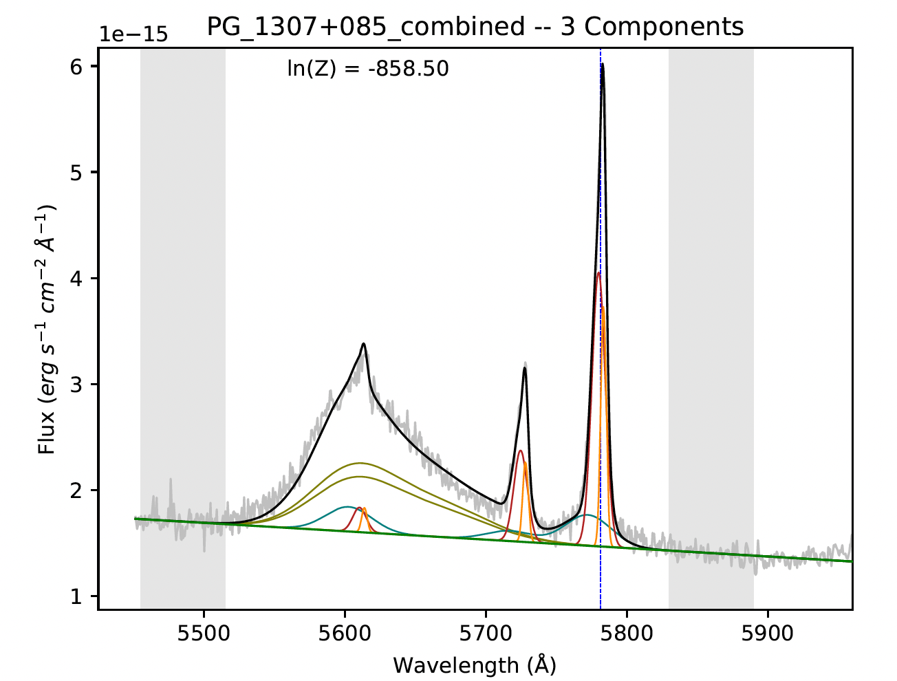

Welcome to BEAT's documentation!
============================================

The Bayesian Evidence Analysis Tool (BEAT) is a Python-based code for measuring and dissecting multi-component emission lines. BEAT was designed to analyze large numbers of spectra (i.e. large surveys or IFU spectroscopy) automatically and determine the number of physical kinematic components in a given set of emission lines. BEAT utilizes the `MultiNest sampling algorithm <https://github.com/farhanferoz/MultiNest>`_  to compute Bayesian statistics and determine the number of components for each fit.

In-depth descriptions of BEAT can be found in the following papers: `Fischer et al. 2017 <https://ui.adsabs.harvard.edu/abs/2017ApJ...834...30F/abstract>`_ (see the Appendix), `Falcone et al. 2024 <https://ui.adsabs.harvard.edu/abs/2024ApJ...971...17F/abstract/>`_   (see Section 3).

BEAT has been used in numerous peer-reviewed studies. These references include:

* `Revalski et al. 2025 <https://ui.adsabs.harvard.edu/abs/2025ApJ...984...32R/abstract/>`_
* `Falcone et al. 2024 <https://ui.adsabs.harvard.edu/abs/2024ApJ...971...17F/abstract/>`_
* `Meena et al. 2023 <https://ui.adsabs.harvard.edu/abs/2023ApJ...943...98M/abstract/>`_
* `Revalski et al. 2021 <https://ui.adsabs.harvard.edu/abs/2021ApJ...910..139R/abstract/>`_
* `Meena et al. 2021 <https://ui.adsabs.harvard.edu/abs/2021ApJ...916...31M/abstract/>`_
* `Trindade Falcão et al. 2021 <https://ui.adsabs.harvard.edu/abs/2021MNRAS.500.1491T/abstract/>`_
* `Fischer et al. 2019 <https://ui.adsabs.harvard.edu/abs/2019ApJ...875..102F/abstract/>`_
* `Revalski et al. 2018 <https://ui.adsabs.harvard.edu/abs/2018ApJ...867...88R/abstract/>`_
* `Fischer et al. 2018 <https://ui.adsabs.harvard.edu/abs/2018ApJ...856..102F/abstract/>`_

**Please note that the documentation is being written over the spring/summer of 2025. We apologize for any inconvenience!**

Contents
--------
.. toctree::
  index
  installation
  customizing_your_fits
  fitting_broad
  interpreting_output
   references
